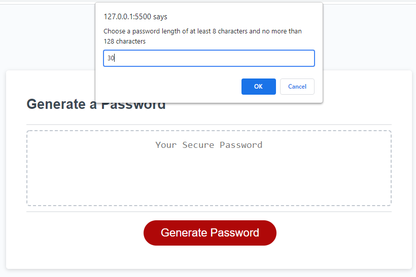

## PASSWORD GENERATOR

- Ask the user for password length
  - If the input is **less than 7**, **greater than 128** or **Alphabet** then a propmt will display that the input is invalid..

[Live URL](https://csarmiento17.github.io/password-generator/)\
[Github URL](https://github.com/csarmiento17/password-generator)

Screenshot for Invalid Input\

Screenshot for Valid input with no numbers option selected\

